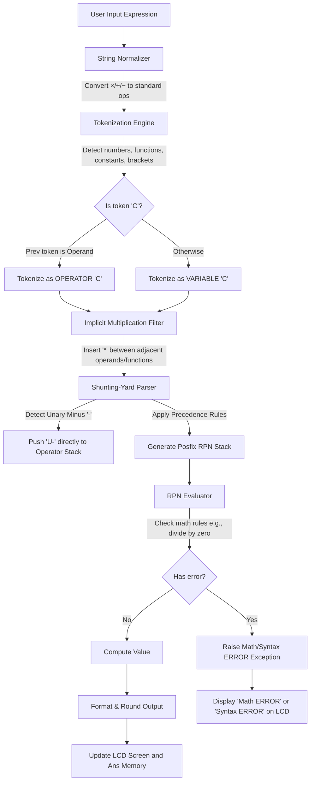

# Casio fx-991EX ClassWiz Calculator Suite

A high-fidelity, multi-platform replication of the physical **Casio fx-991EX ClassWiz** scientific calculator. This project implements a fully unified algebraic parsing engine across four environments: **Web**, **Python**, **Java**, and **C++**.

---

## 📸 Interface Preview

 

---

## 🛠️ Technology Stack

| Platform / Engine | Technologies Used | Core Responsibilities |
| :--- | :--- | :--- |
| **Web Application** | HTML5, CSS3 (Glassmorphism, Carbon textures), Vanilla ES6 JavaScript | Retro-realistic visual layout, interactive LCD, local history, and browser execution. |
| **Python Desktop** | Python 3.13, Tkinter, standard `math` / `re` libraries | Native desktop GUI, Tkinter canvas drawing, and standalone python compiler. |
| **Java Desktop** | Java Swing, AWT Layouts, Java standard math libraries | High-performance compiled Swing GUI, robust stack collections, and multi-thread support. |
| **C++ Core Engine** | C++17, STL containers (`std::vector`, `std::stack`, `std::map`, `std::string`) | Command-line shell, sub-microsecond parser execution, and ultra-high efficiency. |

---

## 🚀 Key Features

* **Natural V.P.A.M. Parsing (Shunting-Yard)**: Evaluates complex expressions without using risky or lazy `eval()` functions, relying on a robust stack-based postfix evaluator.
* **Smart Input Normalization**: Automatically transforms mathematical notations (e.g. `×` $\rightarrow$ `*`, `÷` $\rightarrow$ `/`, `−` $\rightarrow$ `-`, and strips unit degrees `°`).
* **Implicit Multiplication**: Inserts missing operators automatically for cleaner math (e.g., `2π` $\rightarrow$ `2 * π`, `3(5+2)` $\rightarrow$ `3 * (5 + 2)`, `3M` $\rightarrow$ `3 * M`).
* **Context-Sensitive Character 'C'**: Automatically distinguishes combinations (`nCr`) from variable `C` by scanning the preceding token.
* **Unified Operator Precedence**: 
  1. Brackets `()`
  2. Postfix Factorial `!`
  3. Power `^`, Permutations `P`, and Combinations `C`
  4. Unary Negation `U-` (Correctly right-associative; evaluated without premature popping)
  5. Multiplication `*`, Division `/`, and Modulo `%`
  6. Addition `+` and Subtraction `-`
* **Accurate Casio Error Handling**:
  * `Syntax ERROR`: Emitted for invalid grammar, mismatched brackets, or trailing operators.
  * `Math ERROR`: Emitted for division by zero, negative square roots, negative factorials, invalid combination/permutation bounds (e.g. `5C6`), and domain issues (`asin(2.5)`).
* **Memory & Variable System**: Registers `A`, `B`, `C`, `D`, `X`, `Y`, `M` (Memory), and `Ans` (previous result).
* **Setup Modes**: Degree (`DEG`) and Radian (`RAD`) configuration for correct trigonometric outputs.

---

## 📊 Calculator Workflow Diagram

This flowchart outlines the pipeline of an expression from button entry to display formatting:



---

## 🏃 Setup & Execution Instructions

### 1. Web Version
Open `index.html` directly in any web browser, or launch a lightweight HTTP server:
```powershell
python -m http.server 8000
```
Then navigate to `http://localhost:8000`.

### 2. Python Version
Run the Tkinter-based calculator app:
```powershell
python python/calculator.py
```

### 3. Java Version
Compile and execute the Swing desktop application:
```powershell
javac java/src/*.java
java -cp java src.CalculatorApp
```

### 4. C++ Version
Compile the command-line engine using C++17:
```powershell
g++ -std=c++17 cpp/main.cpp cpp/parser.cpp -o cpp/casio_engine.exe
./cpp/casio_engine.exe
```
